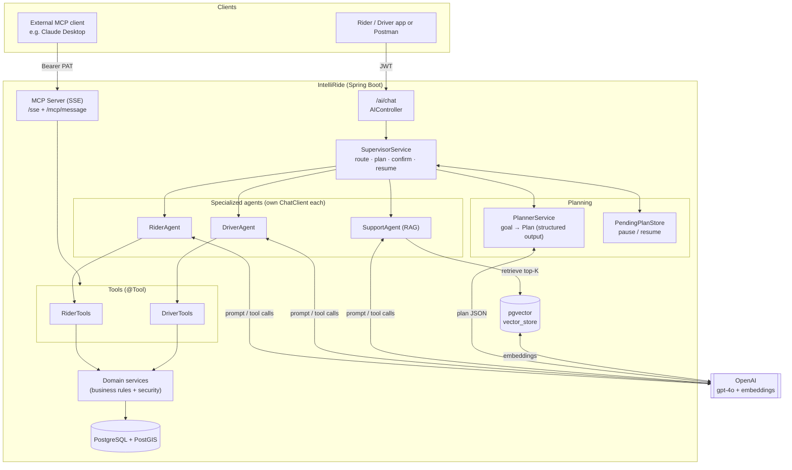
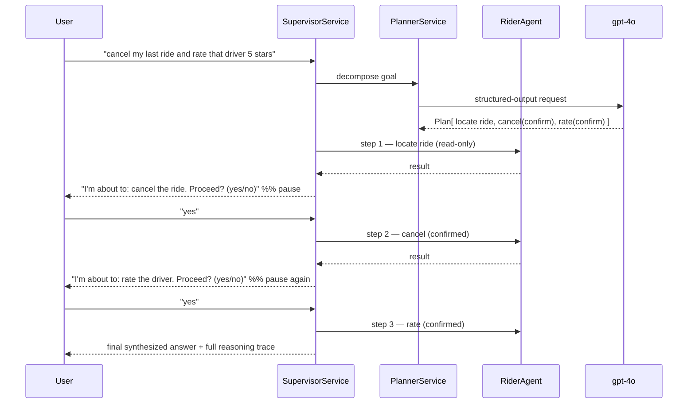

# IntelliRide — Agentic AI Ride-Booking Backend

A Spring Boot ride-hailing backend (riders, drivers, rides, wallet, ratings) augmented with an
**agentic AI layer**: a multi-agent system that routes requests to specialized agents, **plans and
executes multi-step goals autonomously**, asks for human confirmation before changing data, and
returns a full **reasoning trace** of every decision.

It demonstrates five AI building blocks working together:

| Concept | What it does here | Key code |
|--------|-------------------|----------|
| **LLM** | Natural-language understanding & generation (OpenAI `gpt-4o`) | `AIConfig`, per-agent `ChatClient`s |
| **RAG** | Grounds policy/FAQ answers in your own docs via a pgvector store | `RAGService`, `QuestionAnswerAdvisor`, `resources/knowledge/*.md` |
| **AI Agent** | LLMs that *decide which tools to call* and execute them (book/cancel/rate, …) | `RiderTools`, `DriverTools`, `RiderAgent`, `DriverAgent` |
| **Agentic orchestration** | A supervisor that **routes**, **plans** multi-step goals, **confirms** actions, and **resumes** paused plans | `SupervisorService`, `PlannerService`, `PendingPlanStore`, `agents/` |
| **MCP** | Exposes the same tools over the Model Context Protocol so external clients (e.g. Claude Desktop) can drive the app | `McpConfig`, MCP WebMVC/SSE server |

---

## Tech stack

- **Java 21**, **Spring Boot 4.x**
- **Spring AI 2.0** — `ChatClient`, advisors, tool calling, **structured output**, pgvector vector store, MCP server
- **OpenAI** — `gpt-4o` (chat) + `text-embedding-3-small` (embeddings)
- **PostgreSQL + PostGIS** (spatial) + **pgvector** (RAG vector store)
- **Spring Security + JWT**, Redis, OSRM (distance), ModelMapper

---

## The agentic layer (what makes it more than a chatbot)

Every `/ai/chat` request is handled by **`SupervisorService`**, which picks one of three paths:

1. **Direct route** (simple request) — rule-based routing sends the message to the right agent and
   returns the answer in one step.
2. **Plan & execute** (multi-step goal) — `PlannerService` decomposes the goal into a typed `Plan`
   (Spring AI **structured output**), and the supervisor runs the steps in a loop.
3. **Resume** — if a plan is paused awaiting confirmation, the message is treated as the yes/no reply.

**Specialized agents** — each is its own `ChatClient` with its own system prompt, tools, and advisors:

| Agent | Tools | Advisors |
|-------|-------|----------|
| `RiderAgent` | `RiderTools` | chat memory |
| `DriverAgent` | `DriverTools` | chat memory |
| `SupportAgent` | *(none)* | RAG (`QuestionAnswerAdvisor`) |

**Human-in-the-loop (two layers):**
- **Plan-level** — the supervisor pauses on any data-changing step, saves state in `PendingPlanStore`,
  and asks *"Shall I proceed?"*; it resumes on the next request.
- **Tool-level** — each action tool previews with `confirmed=false` and only mutates on `confirmed=true`.

**Reasoning trace** — a shared list every layer appends to (route, plan, delegate, tool call,
confirmation). It's returned in the `reasoning` field of every response, making the agent's
decisions fully observable.

> **Safety guards:** a `MAX_STEPS` cap rejects runaway plans, and the planner falls back to a single
> safe read-only step if the LLM returns a malformed plan.

---

## Architecture




> **Note:** the **MCP path bypasses the agentic layer** — when Claude Desktop calls a tool it hits
> `RiderTools`/`DriverTools` directly, so *its* model is the orchestrator. The supervisor/planner/agents
> only run behind the HTTP `/ai/chat` endpoint.

### How a multi-step goal flows (plan + confirm + resume)



---

## The building blocks, in detail

### 1. LLM
`AIConfig` provides the shared `ChatClient.Builder`, `ChatMemory` (JDBC-backed), and `VectorStore`
beans. Each agent builds its **own** `ChatClient` from the builder with a focused system prompt.

### 2. RAG (Retrieval-Augmented Generation)
- Policy/FAQ documents live in `src/main/resources/knowledge/*.md`.
- `RAGService` chunks + embeds them into the **pgvector** `vector_store`.
- `SupportAgent` uses a `QuestionAnswerAdvisor` to retrieve the most relevant chunks per query and
  ground its answers in *your* data instead of hallucinating.

### 3. AI Agents (tool calling)
The Rider/Driver agents are `ChatClient`s bound to their tools; the LLM autonomously decides which
`@Tool` to invoke:

- **`RiderTools`** — `requestRide`, `rider_cancelRide`, `rateDriver`, `getWalletBalance`, `rider_getMyRides`, `rider_getMyProfile`
- **`DriverTools`** — `acceptRide`, `startRide`, `endRide`, `driver_cancelRide`, `rateRider`, `setAvailability`, …

Design principles baked in:
- **Tools never take the acting user's id** — identity is resolved server-side from the JWT, so the
  model can't act as someone else.
- **Confirmation gate** — mutating tools require a `confirmed=true` second call.
- **Server-side authorization is the real guarantee** — ownership/status checks live in the domain services.
- **Audit logging** — tool invocations log `TOOL <name> <outcome> user=<id>`.

### 4. Agentic orchestration
- **`SupervisorService`** — routes (rule-based), decides plan-vs-direct, runs the execution loop,
  handles confirmation/resume, and synthesizes the final answer.
- **`PlannerService`** — turns a goal into a typed `PlanDto` via `.entity(PlanDto.class)`; each step
  carries its `targetAgent` and a `requiresConfirmation` flag.
- **`PendingPlanStore`** — holds paused plans (in-memory) keyed by `conversationId` for cross-request resume.
- **Reasoning trace** — `ReasoningStepDto` entries (`agent`, `type`, `detail`, `timestamp`) returned
  on every response.

### 5. MCP (Model Context Protocol)
`McpConfig` exposes the same tools over an MCP SSE server (`/sse` + `/mcp/message`). An external MCP
client (Claude Desktop, MCP Inspector) connects and uses the tools — **its** model becomes the agent.

- **Auth**: the MCP connection carries a long-lived JWT via `Authorization: Bearer`; `JwtAuthFilter`
  resolves the user so per-user rules still apply. Mint one with `POST /auth/mcp-token` (valid 30 days).
- Tool names are globally unique (`rider_*` / `driver_*`) for MCP's flat namespace.

---

## Running locally

### Prerequisites
- Java 21, Maven (wrapper included), PostgreSQL with **PostGIS** and **pgvector** extensions, Redis
- An OpenAI API key

### Configuration
Secrets are read from the environment — **do not commit them**:
```bash
export OPENAI_API_KEY=sk-...
```
`application.yaml` references `${OPENAI_API_KEY}`.

### Start
```bash
./mvnw spring-boot:run
```
> `spring.jpa.hibernate.ddl-auto=create-drop` — the database is **recreated on every restart**, then
> `data.sql` seeds demo data.

### Create a test rider and talk to the assistant
```bash
# 1. sign up a rider (signup always creates a RIDER)
curl -s -X POST localhost:8080/auth/signup -H 'Content-Type: application/json' \
  -d '{"name":"Test Rider","email":"testrider@example.com","password":"Test@1234"}'

# 2. login -> JWT access token (valid 10 min)
TOKEN=$(curl -s -X POST localhost:8080/auth/login -H 'Content-Type: application/json' \
  -d '{"email":"testrider@example.com","password":"Test@1234"}' \
  | sed -n 's/.*"accessToken":"\([^"]*\)".*/\1/p')

# 3. chat — the response includes a `reasoning` trace of which agent/planner ran
curl -s -X POST localhost:8080/ai/chat -H "Authorization: Bearer $TOKEN" \
  -H 'Content-Type: application/json' \
  -d '{"message":"cancel my most recent ride and then rate that driver 5 stars"}'
```

Sample response shape:
```json
{
  "data": {
    "reply": "I'm about to: Cancel the most recent ride. Shall I proceed? (yes/no)",
    "conversationId": "user-43",
    "reasoning": [
      { "agent": "PLANNER",    "type": "PLAN",         "detail": "Plan with 3 step(s): [...]" },
      { "agent": "RIDER",      "type": "DELEGATE",     "detail": "RiderAgent handling: ..." },
      { "agent": "SUPERVISOR", "type": "CONFIRMATION", "detail": "Awaiting confirmation for: ..." }
    ]
  },
  "error": null
}
```
Reply **"yes"** in a follow-up request (same token → same `conversationId`) to resume the plan.

### Connect from Claude Desktop (MCP)
`~/Library/Application Support/Claude/claude_desktop_config.json`:
```json
{
  "mcpServers": {
    "intelliride": {
      "command": "/opt/homebrew/bin/npx",
      "args": ["-y", "mcp-remote", "http://localhost:8080/sse", "--transport", "sse-only",
               "--header", "Authorization:${AUTH_HEADER}"],
      "env": { "AUTH_HEADER": "Bearer <token from /auth/mcp-token>" }
    }
  }
}
```
Use the **30-day MCP token** (`POST /auth/mcp-token`), not the 10-minute access token, so you don't
have to restart Claude when it expires. Requires Node 18+.

---

## Key endpoints

| Method | Path | Purpose |
|--------|------|---------|
| POST | `/auth/signup`, `/auth/login` | Auth (returns JWT) |
| POST | `/auth/mcp-token` | Mint a 30-day token for MCP clients |
| POST | `/ai/chat` | Talk to the agentic assistant (`{ "message": "..." }`) — returns `reply` + `reasoning` |
| POST | `/rider/...`, `/drivers/...` | Direct rider/driver actions |
| GET/POST | `/sse`, `/mcp/message` | MCP server (SSE transport) |
| GET | `/swagger-ui.html` | API docs |

`/ai/chat` derives `conversationId` server-side as `user-<id>` from the JWT — the request body is just
`{ "message": "..." }`. All responses are wrapped by `GlobalResponseHandler` as `{ "data": ..., "error": ... }`.

---

## Security notes
- The MCP token is long-lived (30 days) — treat it like an API key and make it revocable before
  exposing the server publicly.

---

## Project layout

```
src/main/java/com/flourish/intelliride/
├── agents/         Agent, AgentRequest, AgentResult, RiderAgent, DriverAgent, SupportAgent
├── configs/        AIConfig (ChatClient/memory/vector beans), McpConfig, WebSecurityConfig, MapperConfig
├── controllers/    AuthController, RiderController, DriverController, AIController
├── tools/          RiderTools, DriverTools          ← agent tools (@Tool)
├── services/       SupervisorService, PlannerService, PendingPlanStore, RAGService + domain services
├── strategies/     fare (default/surge) + driver-matching strategies
├── security/       JwtAuthFilter, JWTService
├── advices/        GlobalResponseHandler, GlobalExceptionHandler
├── dtos/           ChatResponseDto, ReasoningStepDto, PlanDto, PlanStepDto, PendingPlanDto, …
├── entities/       + enums/ (AgentType, StepType, StepStatus, Role, …)
└── resources/
    ├── knowledge/  RAG source docs (fares, wallet, cancellation, faq)
    ├── application.yaml
    └── data.sql    demo seed data
```
