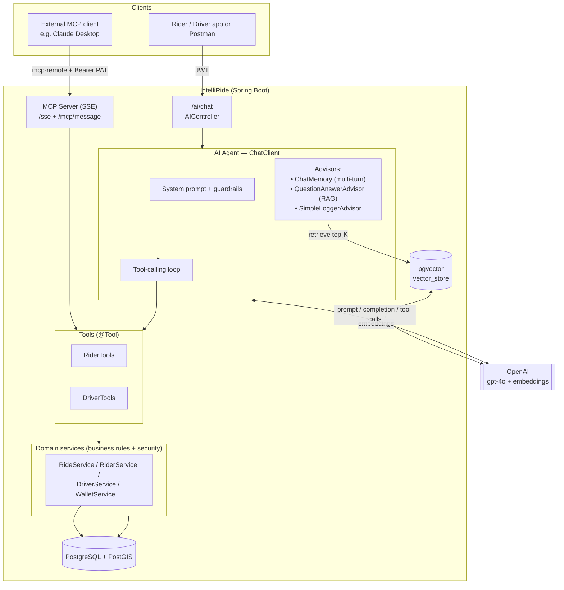
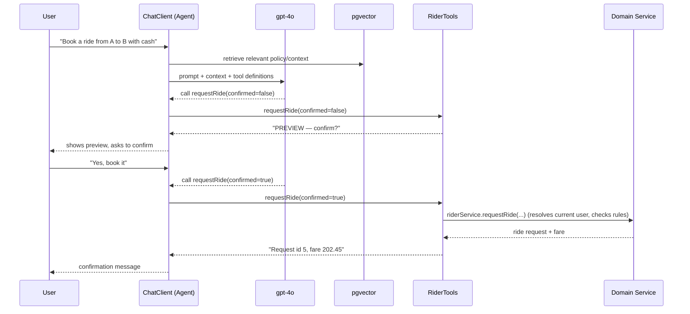

# IntelliRide — AI-Powered Ride-Hailing Backend

A Spring Boot ride-hailing backend (riders, drivers, rides, wallet, ratings) augmented with an
**AI assistant** that can answer questions and **take real actions** on the platform.

It demonstrates four AI building blocks working together:

| Concept | What it does here | Key code |
|--------|-------------------|----------|
| **LLM** | Natural-language understanding & generation (OpenAI `gpt-4o`) | `AIConfig`, `AssistantService` |
| **RAG** | Grounds answers in your own policy/FAQ docs via a pgvector store | `KnowledgeIngestionService`, `QuestionAnswerAdvisor`, `resources/knowledge/*.md` |
| **AI Agent** | An LLM that *decides which tools to call* and executes them (book/cancel/rate, etc.) | `RiderTools`, `DriverTools`, tool-calling `ChatClient` |
| **MCP** | Exposes the same tools over the Model Context Protocol so external clients (e.g. Claude Desktop) can drive the app | `McpConfig`, MCP WebMVC/SSE server |

---

## Tech stack

- **Java 21**, **Spring Boot 4.x**
- **Spring AI 2.0** — `ChatClient`, advisors, tool calling, pgvector vector store, MCP server
- **OpenAI** — `gpt-4o` (chat) + `text-embedding-3-small` (embeddings)
- **PostgreSQL + PostGIS** (spatial) + **pgvector** (RAG vector store)
- **Spring Security + JWT**, Redis, OSRM (distance), ModelMapper

---

## Architecture



### How a request flows (the agent loop)



---

## The four AI pieces, in detail

### 1. LLM
`AIConfig` builds a Spring AI `ChatClient` over OpenAI `gpt-4o` with a system prompt that defines
the assistant's persona and guardrails. `AssistantService.chat()` is the single entry point.

### 2. RAG (Retrieval-Augmented Generation)
- Policy/FAQ documents live in `src/main/resources/knowledge/*.md`.
- `KnowledgeIngestionService` chunks + embeds them into the **pgvector** `vector_store`.
- A `QuestionAnswerAdvisor` retrieves the most relevant chunks per query and injects them into the
  prompt, so answers are grounded in *your* data instead of hallucinated.

### 3. AI Agent (tool calling)
The agent is the `ChatClient` + tools. The LLM autonomously decides which `@Tool` to invoke:

- **`RiderTools`** — `requestRide`, `rider_cancelRide`, `rateDriver`, `getWalletBalance`, `rider_getMyRides`, `rider_getMyProfile`
- **`DriverTools`** — `acceptRide`, `startRide`, `endRide`, `driver_cancelRide`, `rateRider`, `setAvailability`, …

Design principles baked in:
- **Tools never take the acting user's id** — identity is resolved server-side from the JWT
  (`getCurrentRider()` / `getCurrentDriver()`), so the model can't act as someone else.
- **Confirmation gate** — mutating tools require a `confirmed=true` second call; the model previews
  the action and waits for the user to approve.
- **Server-side authorization is the real guarantee** — ownership/status checks live in the domain
  services, not the tools.
- **Audit logging** — every tool invocation logs `TOOL <name> <outcome> user=<id>`.
- Tools are registered **per request by role** (riders get rider tools, drivers get driver tools).

### 4. MCP (Model Context Protocol)
`McpConfig` exposes the same tools over an MCP SSE server (`/sse` + `/mcp/message`). An external MCP
client (Claude Desktop, MCP Inspector, etc.) connects and uses the tools — **its** model becomes the
agent, and IntelliRide is the tool provider.

- **Auth**: the MCP connection carries a long-lived **Personal Access Token** (JWT) via the
  `Authorization: Bearer` header; the existing `JwtAuthFilter` resolves the user, so per-user rules
  still apply. Mint one with `POST /auth/mcp-token`.
- Tool names are globally unique (`rider_*` / `driver_*`) because MCP uses a single flat namespace.

---

## Running locally

### Prerequisites
- Java 21, Maven (wrapper included), PostgreSQL with **PostGIS** and **pgvector** extensions, Redis
- An OpenAI API key

### Configuration
Secrets are read from the environment — **do not commit them**:

```bash
export OPENAI_API_KEY=sk-...
```

`application.yaml` references `${OPENAI_API_KEY}`. (See **Security notes** below.)

### Start
```bash
./mvnw spring-boot:run
```
On startup the schema is created and `data.sql` seeds demo data, including two ready-to-use test
accounts (password `Test@1234`):

| Account | Email | Role |
|---------|-------|------|
| Rider | `testrider@uber.com` | RIDER (wallet 1000) |
| Driver | `testdriver@uber.com` | DRIVER (wallet 500, available) |

> Note: `spring.jpa.hibernate.ddl-auto=create-drop` — the database is **recreated on every restart**.

---

## Key endpoints

| Method | Path | Purpose |
|--------|------|---------|
| POST | `/auth/signup`, `/auth/login` | Auth (returns JWT) |
| POST | `/auth/mcp-token` | Mint a long-lived token for MCP clients |
| POST | `/ai/chat` | Talk to the AI assistant (`{ "message": "...", "conversationId": "..." }`) |
| POST | `/rider/requestRide`, `/rider/cancelRide/{id}`, `/rider/rateDriver` | Rider actions |
| POST | `/drivers/acceptRide/{id}`, `/drivers/startRide/{id}`, `/drivers/endRide/{id}` | Driver actions |
| GET | `/sse`, POST `/mcp/message` | MCP server (SSE transport) |
| GET | `/swagger-ui.html` | API docs |

All responses are wrapped by `GlobalResponseHandler` as `{ "data": ..., "error": ... }`.

### Try the assistant
```bash
TOKEN=$(curl -s -X POST localhost:8080/auth/login -H 'Content-Type: application/json' \
  -d '{"email":"testrider@uber.com","password":"Test@1234"}' | sed -n 's/.*"accessToken":"\([^"]*\)".*/\1/p')

curl -s -X POST localhost:8080/ai/chat -H "Authorization: Bearer $TOKEN" \
  -H 'Content-Type: application/json' \
  -d '{"message":"What is my wallet balance?","conversationId":"demo-1"}'
```

### Connect from Claude Desktop (MCP)
`~/Library/Application Support/Claude/claude_desktop_config.json`:
```json
{
  "mcpServers": {
    "intelliride": {
      "command": "/opt/homebrew/bin/npx",
      "args": ["-y", "mcp-remote", "http://localhost:8080/sse", "--transport", "sse-only",
               "--header", "Authorization:${AUTH_HEADER}"],
      "env": { "AUTH_HEADER": "Bearer <token from /auth/mcp-token>" }
    }
  }
}
```
Requires Node 18+.

---

## Security notes
- **Never commit secrets.** Add `.env` to `.gitignore`. The JWT signing key in `application.yaml`
  (`jwt.secretKey`) should be moved to an environment variable for any real deployment.
- The AI assistant only logs prompts/responses at `DEBUG` for development — disable in production.
- The MCP `mcp-token` is long-lived; treat it like an API key and make it revocable before exposing
  the server publicly.

---

## Project layout

```
src/main/java/com/flourish/intelliride/
├── configs/        AIConfig (ChatClient), McpConfig (MCP tools), WebSecurityConfig, MapperConfig
├── controllers/    AuthController, RiderController, DriverController, AIController
├── tools/          RiderTools, DriverTools          ← AI agent tools (@Tool)
├── services/       AssistantService (AI entry) + domain services & impls
├── strategies/     fare (default/surge) + driver-matching strategies
├── security/       JwtAuthFilter, JWTService
├── advices/        GlobalResponseHandler, GlobalExceptionHandler
├── entities/ dtos/ repositories/
└── resources/
    ├── knowledge/  RAG source docs (fares, wallet, cancellation, faq)
    ├── application.yaml
    └── data.sql    demo seed data + test accounts
```
```
